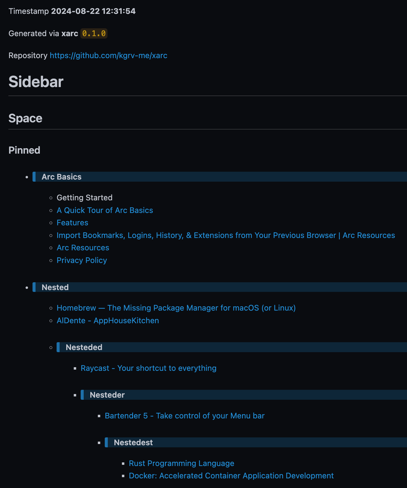
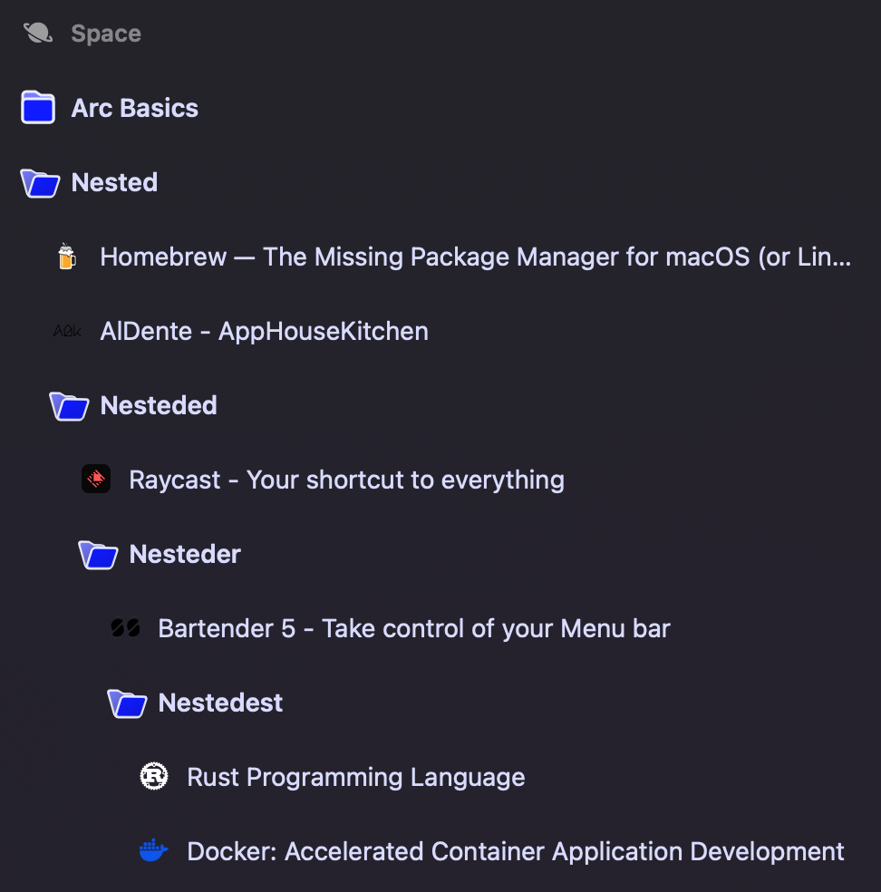

A simple [`python`][python] script to extract sidebar and archived items from [`arc`][arc].
```
It generates Markdown file keeping Arc structures.
```


# SCREENSHOTS
### Markdown Preview


### Arc Sidebar



# REQUIREMENT
- [`python`][python] `>= 3.10`
- [`arc`][arc]


# RECOMMENDATION
- > Close `arc` before running the script.


# SUPPORTED PLATFORMS
```
Same platforms as Arc as of 2024-08-20.
```
- `macOS`
- `Windows`/`WSL`


# USAGE
## Usage Information
```
python3 xarc.py --help
```
```
usage: xarc [-h] [-o OUTPUT] [-d] [-t] [-nc] [-nt] [-nv] [-vc]

A simple script to extract sidebar and archived items from Arc.

options:
  -h, --help            show this help message and exit
  -o OUTPUT, --output OUTPUT
                        set output file
  -d, --debug           enable debug mode
  -t, --trace           enable trace mode
  -nc, --no-colors      disable ASCII colors
  -nt, --no-timestamp   disable filename timestamp
  -nv, --no-version-check
                        disable version check
  -vc, --version-check  run version check

Repository https://github.com/kgrv-me/xarc
```

## CLI
```
python3 xarc.py
```
```
xarc 0.1.0
  INFO  Processing /Users/[BEEP]/Library/Application Support/Arc/StorableSidebar.json
  INFO  Found 9 spaces
  INFO  Found 363 URLs
  INFO  Processing /Users/[BEEP]/Library/Application Support/Arc/StorableArchiveItems.json
  INFO  Found 188 URLs as auto
  INFO  Found 11 URLs as manual
  INFO  Generating xarc_2024-08-22_12-31-54.md
  WARN  Found 5 None instances
  INFO  Up-to-date!
  DONE  Wish you the very best of day, bye!
```

## Output Path
- Pass `-o/--output PATH` to specify output path, default to `xarc_{timestamp}.md`

## Debug / Trace
- Enable by passing `-d/--debug` or `-t/--trace`.
```
python3 xarc.py --debug
```
```
  DEBUG Namespace(output='xarc.md', debug=True, trace=False, no_colors=False, no_timestamp=False, no_version_check=False, version_check=False)
xarc 0.1.0
  DEBUG Darwin
  DEBUG /Users/[BEEP]
  DEBUG /Users/[BEEP]/Library/Application Support/Arc
  DEBUG StorableSidebar.json not found, switching to system path
  INFO  Processing /Users/[BEEP]/Library/Application Support/Arc/StorableSidebar.json
  INFO  Found 9 spaces
  DEBUG ID[SB]: thebrowser.company.defaultPersonalSpacePinnedContainerID
  DEBUG ID[SB]: thebrowser.company.arcBasicsFolderID
  DEBUG ID[SB]: thebrowser.company.arcGettingStarted
  DEBUG ID[SB]: learnArcInMin
  DEBUG ID[SB]: allArcFeatures
  DEBUG ID[SB]: importFromOtherBrowsers
...
```

> Enabling `TRACE` will also enable `DEBUG` mode
- `TRACE` is much more verbose than `DEBUG` mode.
```
  DEBUG Namespace(output='xarc.md', debug=True, trace=True, no_colors=False, no_timestamp=False, no_version_check=False, version_check=False)
xarc 0.1.0
  DEBUG Darwin
  DEBUG /Users/[BEEP]
  DEBUG /Users/[BEEP]/Library/Application Support/Arc
  DEBUG StorableSidebar.json not found, switching to system path
  INFO  Processing /Users/[BEEP]/Library/Application Support/Arc/StorableSidebar.json
  TRACE {
    "title": "Space",
    "id": "thebrowser.company.defaultPersonalSpaceID",
    "containers": {
        "unpinned": "thebrowser.company.defaultPersonalSpaceUnpinnedContainerID",
        "pinned": "thebrowser.company.defaultPersonalSpacePinnedContainerID"
    }
}
  ...
  INFO  Found 9 spaces
  DEBUG ID[SB]: thebrowser.company.defaultPersonalSpacePinnedContainerID
  DEBUG ID[SB]: thebrowser.company.arcBasicsFolderID
  DEBUG ID[SB]: thebrowser.company.arcGettingStarted
  TRACE   - Getting Started
  DEBUG ID[SB]: learnArcInMin
  TRACE   - [A Quick Tour of Arc Basics](https://start.arc.net/quick-tour-of-arc)
  DEBUG ID[SB]: allArcFeatures
  TRACE   - [Features](https://browserinc.notion.site/Features-9345b6bf346346d2badc69f0b1749441)
  ...
```

## Markdown
- Taking a look inside `xarc_2024-08-22_12-31-54.md`
```
Timestamp **2024-08-22 12:31:54**

Generated via **xarc** `0.1.0`

Repository [https://github.com/kgrv-me/xarc](https://github.com/kgrv-me/xarc)


# Sidebar
## Space
### Pinned
- > #### Arc Basics
  - Getting Started
  - [A Quick Tour of Arc Basics](https://start.arc.net/quick-tour-of-arc)
  - [Features](https://browserinc.notion.site/Features-9345b6bf346346d2badc69f0b1749441)
  - [Import Bookmarks, Logins, History, & Extensions from Your Previous Browser | Arc Resources](https://resources.arc.net/en/articles/6663124-import-bookmarks-logins-history-extensions-from-your-previous-browser)
  - [Arc Resources](https://resources.arc.net/en/)
  - [Privacy Policy](https://thebrowser.company/privacy/)
- > #### Nested
  - [Homebrew — The Missing Package Manager for macOS (or Linux)](https://brew.sh/)
  - [AlDente - AppHouseKitchen](https://apphousekitchen.com/)
  - > #### Nesteded
    - [Raycast - Your shortcut to everything](https://www.raycast.com/)
    - > #### Nesteder
      - [Bartender 5 - Take control of your Menu bar](https://www.macbartender.com/)
      - > #### Nestedest
        - [Rust Programming Language](https://www.rust-lang.org/)
        - [Docker: Accelerated Container Application Development](https://www.docker.com/)
```


# CHANGELOG
## 0.1.0
### 2024-08-22
```
Added
- source files
```


[python]: https://www.python.org/
[arc]: https://arc.net/
